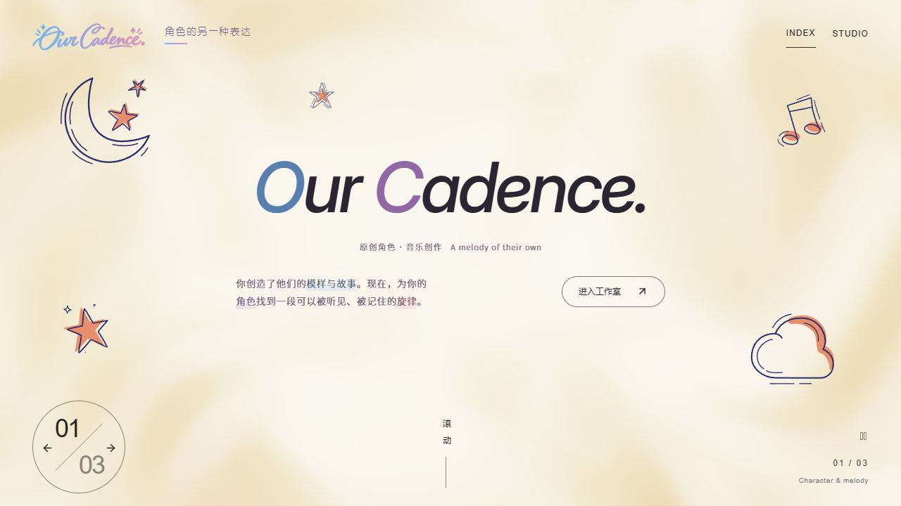
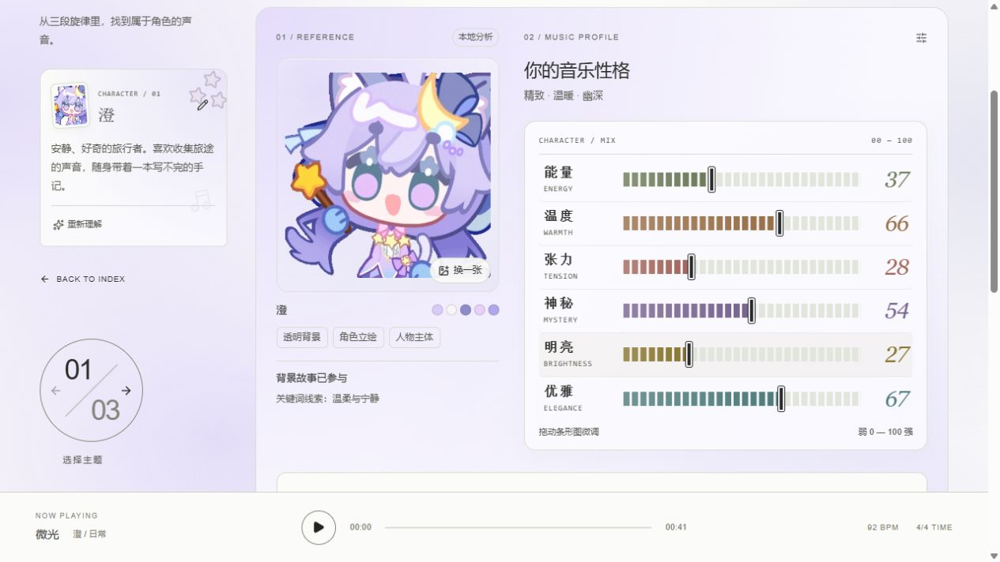
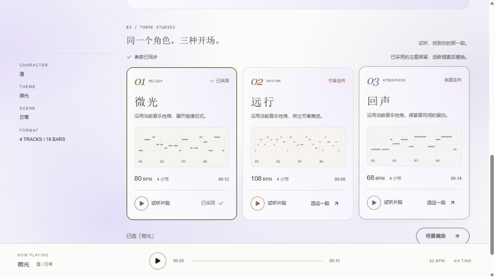
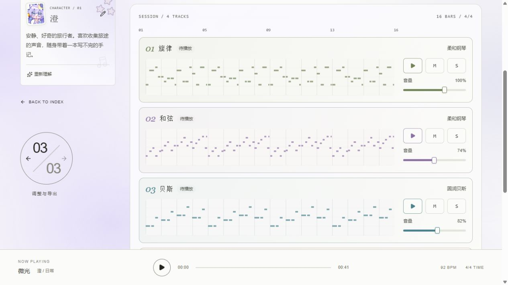

# Our Cadence

> 角色的另一种表达。

从一张参考图和一段背景故事出发，为原创角色寻找主题旋律，再延展成日常、回忆与战斗配乐。

**图片与故事 → 音乐性格 → 主题试听 → 场景编曲 → 保存与导出**



## 可以做什么

| 创作环节 | 当前能力 |
| --- | --- |
| 认识角色 | 上传参考图片、填写背景故事，结合本地视觉特征与故事关键词分析 |
| 调整音乐性格 | 能量、温度、张力、神秘、明亮、优雅六项可视化参数 |
| 寻找主题 | 三个四小节提案，支持试听、换一组与采用主题；调参后自动更新候选 |
| 延展场景 | 日常、回忆、战斗三种十六小节编曲；旋律、和弦、贝斯、鼓四轨 |
| 打磨声音 | 七种旋律音色，支持速度、单轨试听、静音／独奏、分轨音量与总音量调整 |
| 留住作品 | 本地草稿、版本快照、JSON 工程导入导出，以及 MIDI／WAV 导出 |
| 可选 AI 谱曲 | 配置 API 后，使用 GPT-6 Astra 根据角色故事、可选图片和主题生成四轨乐谱 |

七种旋律音色：柔和钢琴、钟琴、木吉他、弦乐铺底、长笛、小提琴、马林巴。

## 工作室预览

以下为 **2026-09-18 当前版本的真实界面截图**。工作室截图使用本地规则编曲，无需付费模型即可试听。

### 图片与音乐性格

保留角色背景故事，用六项参数调整音乐方向，背景色随参考图片变化。



### 同一个角色，三种开场

先听旋律，再选择属于角色的主题；卡片中的音符预览对应实际候选。



### 四轨混音与导出

按声部试听、调整音量，完成后导出音乐。下图展示混音台中的旋律、和弦与贝斯部分，鼓轨位于下方。



## 本地运行

需要 **Node.js 24** 和 Git。首次安装需要联网。

```sh
git clone https://github.com/umi3730/our-cadence.git
cd our-cadence/studio
npm run install:ci
npm run dev
```

打开终端显示的地址，通常为 `http://localhost:5173`；工作室入口为 `/studio`。

**本地规则作曲无需 API Key、数据库、云账号或 Codex 插件。** 默认使用 portable 开发模式。乐器优先加载采样音源，网络不可用时使用内置合成音色。

## 可选 AI 谱曲

在 `studio/.env.local` 配置官方或兼容公司网关的 API Key，重启服务后，在场景页点击“生成 AI 编曲”。示例配置见 [studio/.env.example](studio/.env.example)。

- AI 谱曲仅在手动点击时调用并消耗相应 API 额度；切换已有乐谱音色、混音与导出在本地完成。
- AI 输出的是经过校验的音符与段落数据，音频仍由工作室音源渲染。
- 可以随时切回“规则草稿”；生成失败或取消不会覆盖现有作品。
- 高级图片语义分析是独立的可选接口，仍使用官方配置；公司网关当前只用于谱曲。

接口、配置和已知边界见 [GPT 谱曲说明](studio/design/gpt-composer.md)。**Suno 尚未接入。**

## 数据与项目状态

- 草稿和版本保存在当前浏览器的 `localStorage`，不会随 Git 同步，也不是云端存档。
- 和朋友分享作品：在工作室导出 JSON 工程，由对方导入。
- API Key 只放服务端本地配置，不进入前端、截图或 Git。
- 当前仍是声音原型，暂未实现账号登录与云端存档。
- 最近验证：类型检查、生产构建通过；测试 **21 项中 20 项通过**，另有一项已记录的规则主题调式问题。详情见 [最新改动记录](修改日志/2026-09-18_六维参数与视觉谱曲更新.md)。

## 开发与协作

技术栈：React 19、TypeScript、vinext / Vite、Web Audio、Radix UI、Lottie。

每个功能使用独立分支，在 `studio/` 内验证：

```sh
npm run typecheck
npm test
npm run build
```

提交源码、必要素材和依赖锁文件；个人配置、`node_modules`、构建产物与试听导出文件不入库。

| 路径 | 用途 |
| --- | --- |
| [studio/](studio/) | 应用源码、测试与运行脚本 |
| [studio/README.md](studio/README.md) | 功能边界与开发说明 |
| [docs/screenshots/](docs/screenshots/) | GitHub 项目预览截图 |
| [design/brand/](design/brand/) | Logo 设计稿与说明 |
| [design/assets/](design/assets/) | 装饰素材来源与授权记录 |
| [修改日志/](修改日志/) | 改动、验证结果与已知问题 |
| [需求与开发路线](Our%20Cadence-需求与开发路线-v0.1.md) | 早期需求与后续方向，以当前源码和修改日志为准 |

字体与第三方素材沿用各自许可证，授权文件随素材保留，具体见 [素材说明](design/assets/README.md) 与 [字体来源](studio/public/fonts/GlowSans-SOURCE.md)。

需要打包分享源码时，可在项目根目录运行 `powershell -ExecutionPolicy Bypass -File scripts/package-source.ps1`，输出位于被 Git 忽略的 `releases/`。
